## Deploy Azure Container Apps on AKS using an ARM Template

The following Jumpstart scenario will guide you on how to deploy a "Ready to Go" environment so you can start using [Azure Container Apps](https://learn.microsoft.com/azure/container-apps/azure-arc-overview) deployed on Azure Arc-enabled [Azure Kubernetes Service (AKS)](https://learn.microsoft.com/azure/aks/intro-kubernetes) cluster using [Azure ARM Template](https://learn.microsoft.com/azure/azure-resource-manager/templates/overview).

By the end of this scenario, you will have an Azure Kubernetes Service (AKS) cluster deployed with the Azure Container Apps connected environment, a sample Web Application and a Microsoft Windows Server 2022 (Datacenter) Azure VM, installed & pre-configured with all the required tools needed to work with Azure Container Apps.

> **Note:** Currently, Azure Arc-enabled Container Apps is in preview.

The following Jumpstart scenario will guide you on how to run cloud-native application on [Azure Container Apps](https://azure.microsoft.com/products/container-apps/). The Azure Container Apps service enables you to run microservices and containerized applications on a serverless platform. Individual container apps are deployed to a single Container Apps environment, which acts as a secure boundary around groups of container apps.

In this scenario, you will deploy a [Container Apps environment](https://learn.microsoft.com/azure/container-apps/environment) and a 3-node container app running in Azure. The app leverages [Dapr](https://learn.microsoft.com/azure/container-apps/dapr-overview?tabs=bicep1%2Cyaml) to simplify service to service invocation.

- Store - The store app is the store's frontend app, running a [Blazor Server project](https://learn.microsoft.com/dotnet/architecture/blazor-for-web-forms-developers/introduction) that reaches out to the backend APIs.
- Products API - This API is a [Swagger UI-enabled API](https://swagger.io/tools/swagger-ui/) that hands back product names and IDs to callers.
- Inventory API - A simple API that provides a random number for a given product ID string. The values of each string/integer pair are stored in a memory cache so they are consistent between API calls.

## Prerequisites

- Clone the Arc Jumpstart GitHub repository

    ```shell
    git clone https://github.com/microsoft/azure_arc.git
    ```

- [Install or update Azure CLI to version 2.65.0 and above](https://learn.microsoft.com/cli/azure/install-azure-cli?view=azure-cli-latest). Use the below command to check your current installed version.

  ```shell
  az --version
  ```

- [Generate a new SSH key pair](https://learn.microsoft.com/azure/virtual-machines/linux/create-ssh-keys-detailed) or use an existing one (Windows 10 and above now comes with a built-in ssh client).

  ```shell
  ssh-keygen -t rsa -b 4096
  ```

  To retrieve the SSH public key after it's been created, depending on your environment, use one of the below methods:
  - In Linux, use the `cat ~/.ssh/id_rsa.pub` command.
  - In Windows (CMD/PowerShell), use the SSH public key file that by default, is located in the _`C:\Users\WINUSER/.ssh/id_rsa.pub`_ folder.

  SSH public key example output:

  ```shell
  ssh-rsa o1djFhyNe5NXyYk7XVF7wOBAAABgQDO/QPJ6IZHujkGRhiI+6s1ngK8V4OK+iBAa15GRQqd7scWgQ1RUSFAAKUxHn2TJPx/Z/IU60aUVmAq/OV9w0RMrZhQkGQz8CHRXc28S156VMPxjk/gRtrVZXfoXMr86W1nRnyZdVwojy2++sqZeP/2c5GoeRbv06NfmHTHYKyXdn0lPALC6i3OLilFEnm46Wo+azmxDuxwi66RNr9iBi6WdIn/zv7tdeE34VAutmsgPMpynt1+vCgChbdZR7uxwi66RNr9iPdMR7gjx3W7dikQEo1djFhyNe5rrejrgjerggjkXyYk7XVF7wOk0t8KYdXvLlIyYyUCk1cOD2P48ArqgfRxPIwepgW78znYuwiEDss6g0qrFKBcl8vtiJE5Vog/EIZP04XpmaVKmAWNCCGFJereRKNFIl7QfSj3ZLT2ZXkXaoLoaMhA71ko6bKBuSq0G5YaMq3stCfyVVSlHs7nzhYsX6aDU6LwM/BTO1c= user@pc
  ```

- Create Azure service principal (SP)

    To be able to complete the scenario and its related automation, Azure service principal assigned with the “Contributor” role is required. To create it, login to your Azure account run the below Bash shell command (this can also be done in [Azure Cloud Shell](https://shell.azure.com/)).

    ```shell
    az login
    subscriptionId=$(az account show --query id --output tsv)
    az ad sp create-for-rbac -n "<Unique SP Name>" --role "Contributor" --scopes /subscriptions/$subscriptionId
    ```

    For example:

    ```shell
    az login
    subscriptionId=$(az account show --query id --output tsv)
    az ad sp create-for-rbac -n "JumpstartArcK8s" --role "Contributor" --scopes /subscriptions/$subscriptionId
    ```

    Output should look like this:

    ```json
    {
    "appId": "XXXXXXXXXXXXXXXXXXXXXXXXXXXX",
    "displayName": "JumpstartArcK8s",
    "password": "XXXXXXXXXXXXXXXXXXXXXXXXXXXX",
    "tenant": "XXXXXXXXXXXXXXXXXXXXXXXXXXXX"
    }
    ```

    > **Note:** If you create multiple subsequent role assignments on the same service principal, your client secret (password) will be destroyed and recreated each time. Therefore, make sure you grab the correct password.

    > **Note:** The Jumpstart scenarios are designed with as much ease of use in-mind and adhering to security-related best practices whenever possible. It is optional but highly recommended to scope the service principal to a specific [Azure subscription and resource group](https://learn.microsoft.com/cli/azure/ad/sp?view=azure-cli-latest) as well considering using a [less privileged service principal account](https://learn.microsoft.com/azure/role-based-access-control/best-practices).

## Automation Flow

- User is editing the ARM template parameters file (1-time edit). These parameters values are being used throughout the deployment.

- Main [_azuredeploy_ ARM template](https://github.com/microsoft/azure_arc/blob/main/azure_arc_app_services_jumpstart/aks/ARM/azuredeploy.json) will initiate the deployment of the linked ARM templates:

  - [_VNET_](https://github.com/microsoft/azure_arc/blob/main/azure_arc_app_services_jumpstart/aks/ARM/VNET.json) - Deploys a Virtual Network with a single subnet to be used by the Client virtual machine.
  - [_aks_](https://github.com/microsoft/azure_arc/blob/main/azure_arc_app_services_jumpstart/aks/ARM/aks.json) - Deploys the AKS cluster where all the Azure Container Apps on Azure Arc-enabled Kubernetes will be deployed.
  - [_clientVm_](https://github.com/microsoft/azure_arc/blob/main/azure_arc_app_services_jumpstart/aks/ARM/clientVm.json) - Deploys the client Windows VM. This is where all user interactions with the environment are made from.
  - [_logAnalytics_](https://github.com/microsoft/azure_arc/blob/main/azure_arc_app_services_jumpstart/aks/ARM/logAnalytics.json) - Deploys Azure Log Analytics workspace to to view diagnostic information of the Container Apps.

- User remotes into client Windows VM, which automatically kicks off the [_ContainerAppsLogonScript_](https://github.com/microsoft/azure_arc/blob/main/azure_arc_app_services_jumpstart/aks/ARM/artifacts/ContainerAppsLogonScript.ps1) PowerShell script that deploys the AKS cluster, configures Azure Container Apps environment and deploy the Container Apps on the AKS cluster.

## Deployment

As mentioned, this deployment will leverage ARM templates. You will deploy a single template that will initiate the entire automation for this scenario.

- The deployment is using the ARM template parameters file. Before initiating the deployment, edit the [_azuredeploy.parameters.json_](https://github.com/microsoft/azure_arc/blob/main/azure_arc_app_services_jumpstart/aks/ARM/azuredeploy.parameters.json) file located in your local cloned repository folder. An example parameters file is located [here](https://github.com/microsoft/azure_arc/blob/main/azure_arc_app_services_jumpstart/aks/ARM/artifacts/azuredeploy.parameters.example.json).

  - _`sshRSAPublicKey`_ - Your SSH public key
  - _`spnClientId`_ - Your Azure service principal id
  - _`spnClientSecret`_ - Your Azure service principal secret
  - _`spnTenantId`_ - Your Azure tenant id
  - _`windowsAdminUsername`_ - Client Windows VM Administrator username
  - _`windowsAdminPassword`_ - Client Windows VM Password. Password must have 3 of the following: 1 lower case character, 1 upper case character, 1 number, and 1 special character. The value must be between 12 and 123 characters long.
  - _`logAnalyticsWorkspaceName`_ - Unique name for the deployment log analytics workspace.
  - _`deployContainerApps`_ - Boolean that sets whether or not to deploy Azure Container Apps environment and a Web App. For this scenario, we leave it set to *`true`*.
  - _`deployAppService`_ - Boolean that sets whether or not to deploy App Service plan and a Web App. For this scenario, we leave it set to *`false`*.
  - _`deployFunction`_ - Boolean that sets whether or not to deploy App Service plan and an Azure Function application. For this scenario, we leave it set to *`false`*.
  - _`deployAPIMgmt`_ - Boolean that sets whether or not to deploy a self-hosted Azure API Management gateway.  For this scenario, we leave it set to *`false`*.
  - _`deployLogicApp`_ - Boolean that sets whether or not to deploy App Service plan and an Azure Logic App. For this scenario, we leave it set to *`false`*.
  - _`templateBaseUrl`_ - GitHub URL to the deployment template - filled in by default to point to [Microsoft/Azure Arc](https://aka.ms/JumpstartGitHubCode) repository, but you can point this to your forked repo as well.
  - _`adminEmail`_ - an email address that will be used on the Azure API Management deployment to receive all system notifications.
  - _`deployBastion`_ - Choice (true | false) to deploy [Azure Bastion](https://learn.microsoft.com/azure/bastion/bastion-overview) or not to connect to the client VM.
  - _`bastionHostName`_ - Azure Bastion host name.

- To deploy the ARM template, navigate to the local cloned [deployment folder](https://github.com/microsoft/azure_arc/tree/main/azure_arc_app_services_jumpstart/aks/ARM) and run the below command:

    ```shell
    az group create --name <Name of the Azure resource group> --location <Azure Region>
    az deployment group create \
    --resource-group <Name of the Azure resource group> \
    --name <The name of this deployment> \
    --template-uri https://raw.githubusercontent.com/microsoft/azure_arc/main/azure_arc_app_services_jumpstart/aks/ARM/azuredeploy.json \
    --parameters <The _azuredeploy.parameters.json_ parameters file location>
    ```

    > **Note:** Make sure that you are using the same Azure resource group name as the one you've just used in the `azuredeploy.parameters.json` file.

    For example:

    ```shell
    az group create --name Arc-AppSvc-Demo --location "East US"
    az deployment group create \
    --resource-group Arc-AppSvc-Demo \
    --name arccontainerapps \
    --template-uri https://raw.githubusercontent.com/microsoft/azure_arc/main/azure_arc_app_services_jumpstart/aks/ARM/azuredeploy.json \
    --parameters azuredeploy.parameters.json
    ```

    > **Note:** The deployment time for this scenario can take ~10-20min.

    > **Note:** Since Azure Container App on Azure Arc-enabled Kubernetes is [currently in preview](https://learn.microsoft.com/azure/container-apps/azure-arc-overview#public-preview-limitations), deployment regions availability is limited to East US, East Asia and West Europe.

    > **Note:** If you receive an error message stating that the requested VM size is not available in the desired location (as an example: 'Standard_D8s_v3'), it means that there is currently a capacity restriction for that specific VM size in that particular region. Capacity restrictions can occur due to various reasons, such as high demand or maintenance activities. Microsoft Azure periodically adjusts the available capacity in each region based on usage patterns and resource availability. To continue deploying this scenario, please try to re-run the deployment using another region.

- Once Azure resources has been provisioned, you will be able to see it in Azure portal.

    

    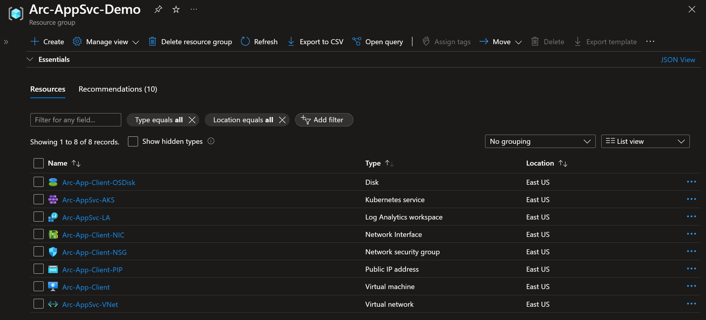

## Windows Login & Post Deployment

Various options are available to connect to _Arc-App-Client_ VM, depending on the parameters you supplied during deployment.

- [RDP](#connecting-directly-with-rdp) - available after configuring access to port 3389 on the _Arc-App-Client-NSG_, or by enabling [Just-in-Time access (JIT)](#connect-using-just-in-time-access-jit).
- [Azure Bastion](#connect-using-azure-bastion) - available if *`true`* was the value of your _`deployBastion`_ parameter during deployment.

### Connecting directly with RDP

By design, port 3389 is not allowed on the network security group. Therefore, you must create an NSG rule to allow inbound 3389.

- Open the _Arc-App-Client-NSG_ resource in Azure portal and click "Add" to add a new rule.

  

  

- Specify the IP address that you will be connecting from and select RDP as the service with "Allow" set as the action. You can retrieve your public IP address by accessing [https://icanhazip.com](https://icanhazip.com) or [https://whatismyip.com](https://whatismyip.com).

  

  

  

### Connect using Azure Bastion

- If you have chosen to deploy Azure Bastion in your deployment, use it to connect to the VM.

  

  > **Note:** When using Azure Bastion, the desktop background image is not visible. Therefore some screenshots in this guide may not exactly match your experience if you are connecting with Azure Bastion.

### Connect using just-in-time access (JIT)

If you already have [Microsoft Defender for Cloud](https://learn.microsoft.com/azure/defender-for-cloud/just-in-time-access-usage?tabs=jit-config-asc%2Cjit-request-asc) enabled on your subscription and would like to use JIT to access the Client VM, use the following steps:

- In the Client VM configuration pane, enable just-in-time. This will enable the default settings.

  

  

### Post Deployment

- At first login, as mentioned in the "Automation Flow" section above, the [_ContainerAppsLogonScript_](https://github.com/microsoft/azure_arc/blob/main/azure_arc_app_services_jumpstart/aks/ARM/artifacts/ContainerAppsLogonScript.ps1) PowerShell logon script will start it's run.

- Let the script to run its course and **do not close** the PowerShell session, this will be done for you once completed. Once the script will finish it's run, the logon script PowerShell session will be closed, the Windows wallpaper will change and the Azure web application will be deployed on the cluster and be ready to use.

    > **Note:** As you will notices from the screenshots below, during the Azure Container Apps connected environment, the pods will be restarted and will go through multiple Kubernetes pod lifecycle stages. This is normal and can safely be ignored. To learn more about the various Container Apps extension, visit the [Azure documentation page](https://learn.microsoft.com/azure/container-apps/azure-arc-overview#resources-created-by-the-container-apps-extension).

    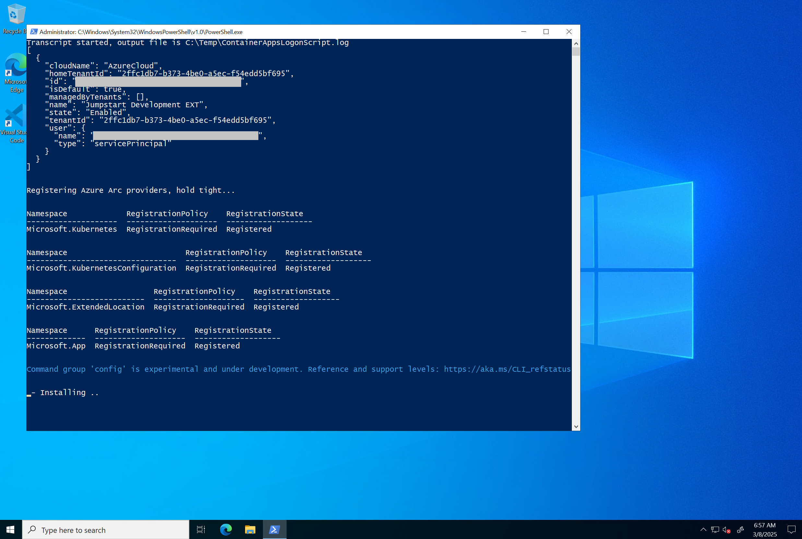

    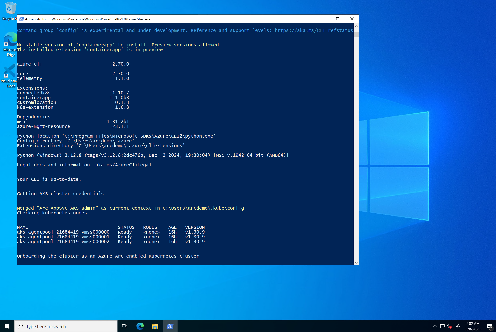

    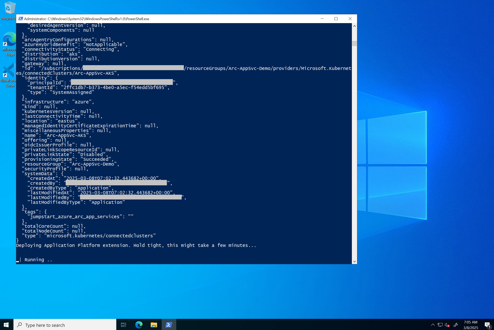

    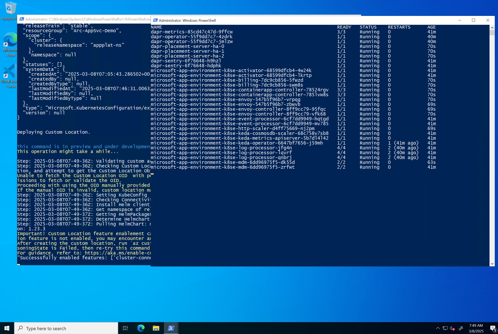

    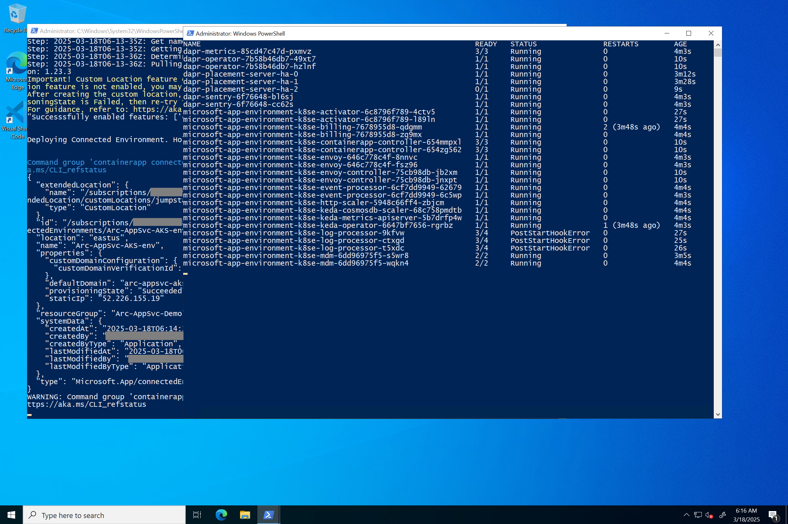

    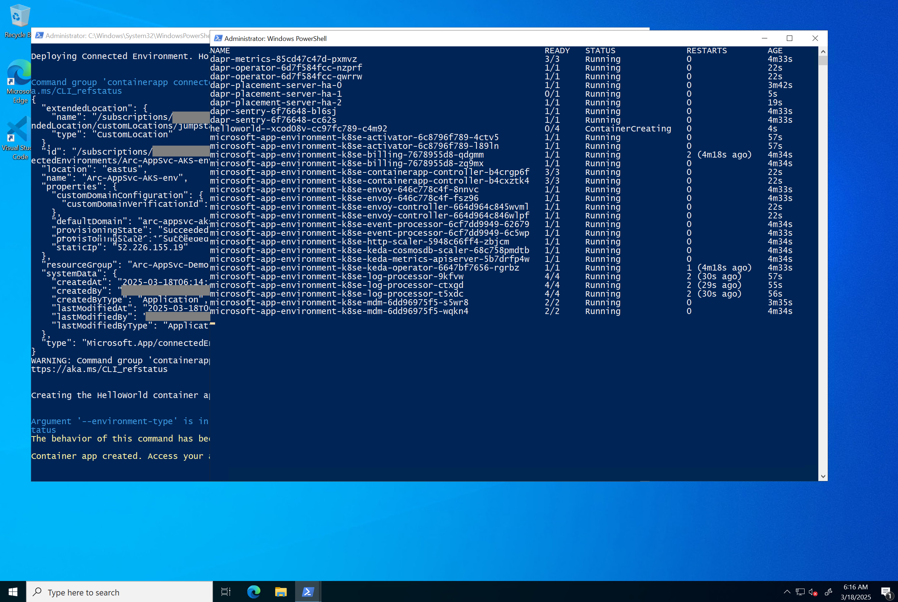

    

    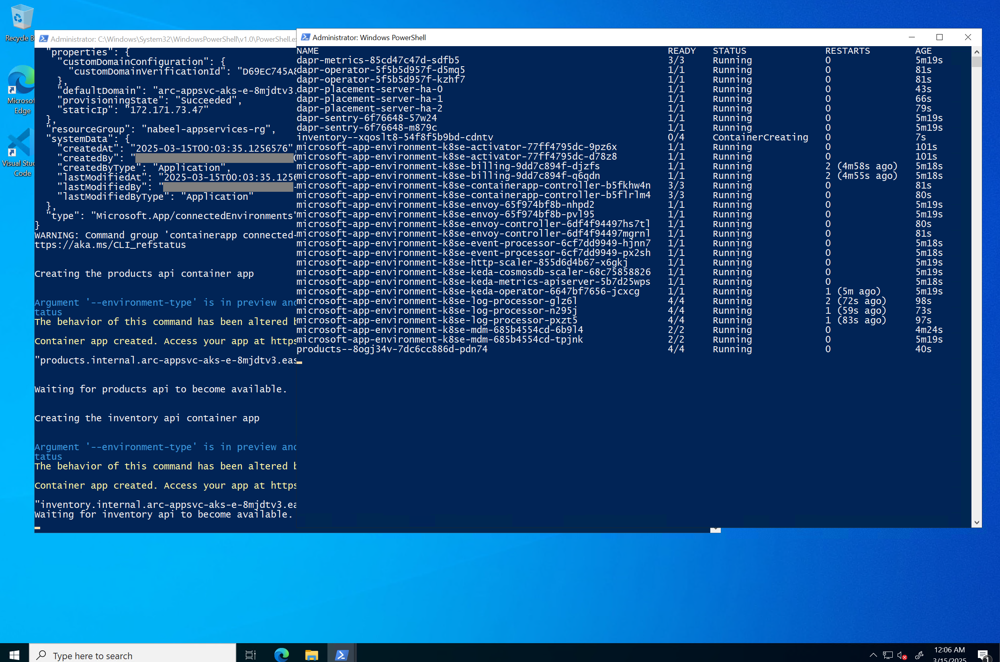

  Once the script finishes it's run, the logon script PowerShell session will be closed, the Windows wallpaper will change, and the Azure Container Apps deployed on the cluster will be ready.

    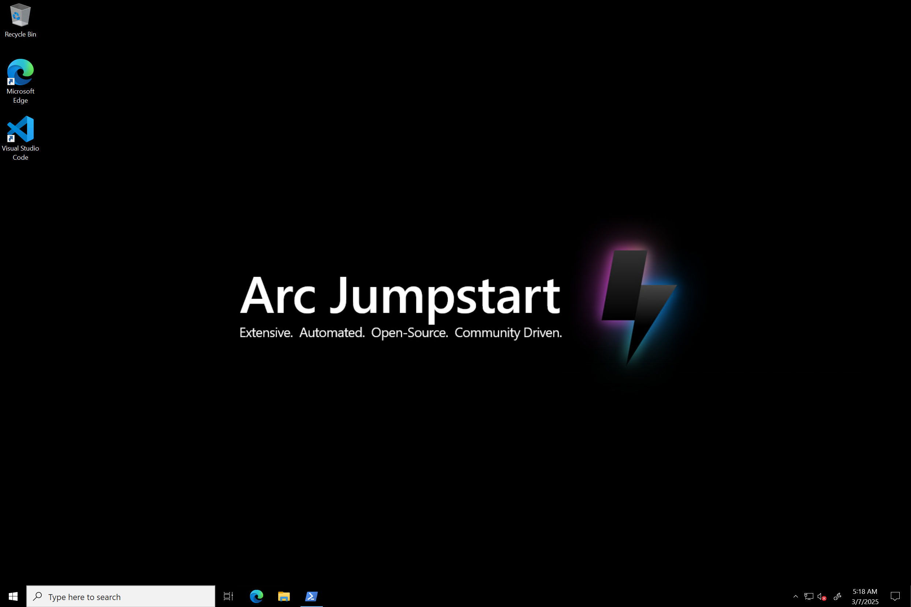

- Since this scenario is deploying both the Azure Container Apps, you will also notice additional, newly deployed Azure resources in the resources group. The important ones to notice are:

  - **Azure Arc-enabled Kubernetes cluster** - Azure Arc-enabled Kubernetes are used to deploy the Azure Containers Apps [cluster extension](https://learn.microsoft.com/azure/azure-arc/kubernetes/conceptual-extensions), as well as using Azure Arc [Custom locations](https://learn.microsoft.com/azure/azure-arc/kubernetes/conceptual-custom-locations).

  - **Custom location** - Provides a way for tenant administrators to use their Azure Arc-enabled Kubernetes clusters as a target location for deploying Azure services.

  - **Container Apps Connected Environment**- Container Apps connected environment enables common configuration across apps but is not related to cluster operations. Conceptually, it's deployed into the Custom location resource, and app developers create apps in this environment.

  - **Container App** - Azure Container Apps manages the details of Kubernetes and container orchestration for you. Containers in Azure Container Apps can use any runtime, programming language, or development stack of your choice.
  
  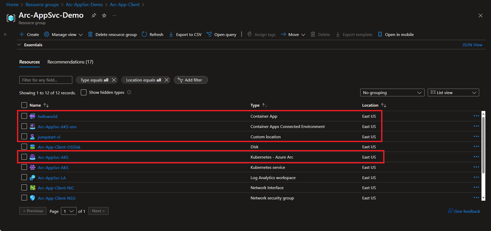

- In this scenario, **ASP.NET Core Front-end and 2 Back-end APIs on Azure Container Apps** was deployed. To open the deployed web application in your web browser, simply click the Container App resource and the Application URL.

  

  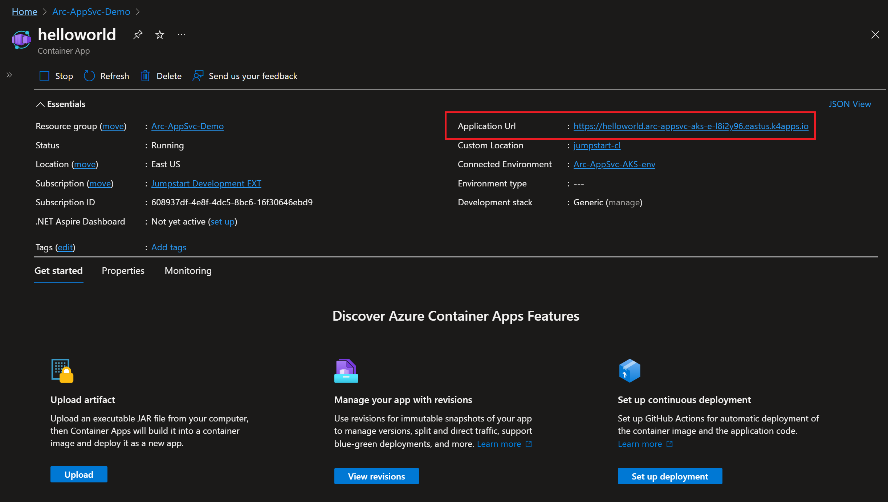

  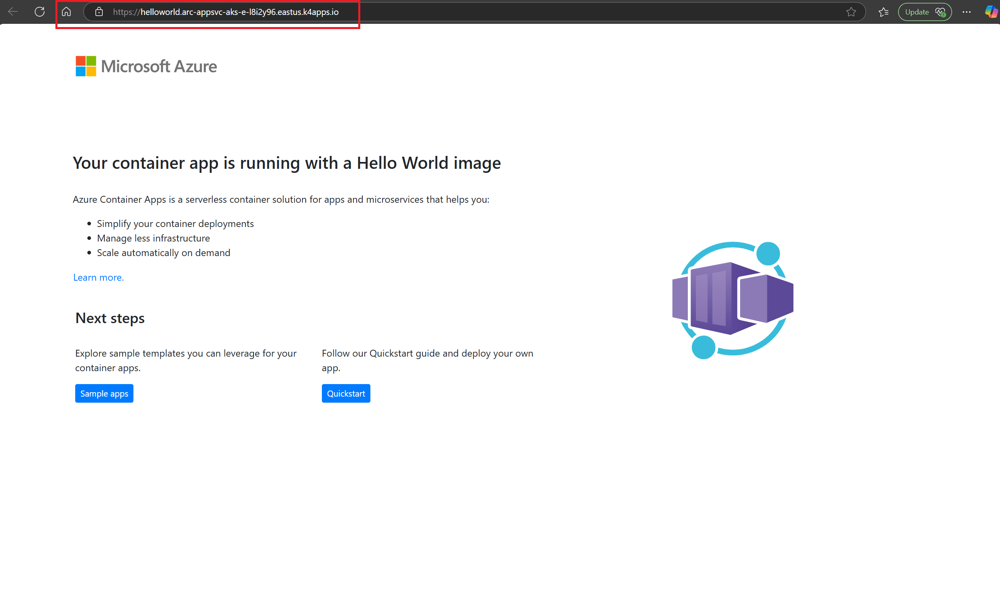

- Optionally, you can review the [Dapr](https://learn.microsoft.com/azure/container-apps/dapr-overview?tabs=bicep1%2Cyaml) configuration for the Container apps by navigating to the Dapr setting.

  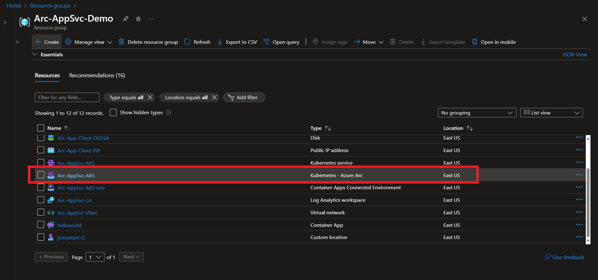

## Cluster extensions

In this scenario, the Azure Container Apps extension was deployed and used throughout this scenario in order to deploy the Azure Container Apps infrastructure.

- In order to view cluster extensions, click on the Azure Arc-enabled Kubernetes resource Extensions settings.

  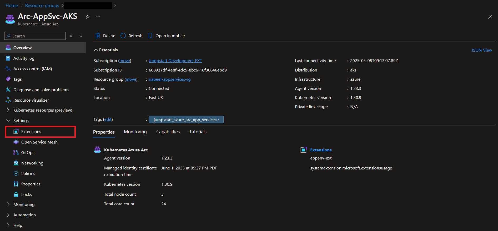

  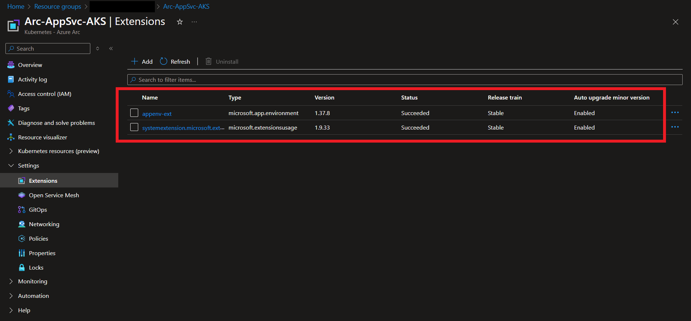

## View your application's diagnostics

In this scenario, the Log Analytics was configured with the Container Apps extension to view diagnostic information.

- Navigate to the Log Analytics workspace that's configured with your Container Apps extension.

  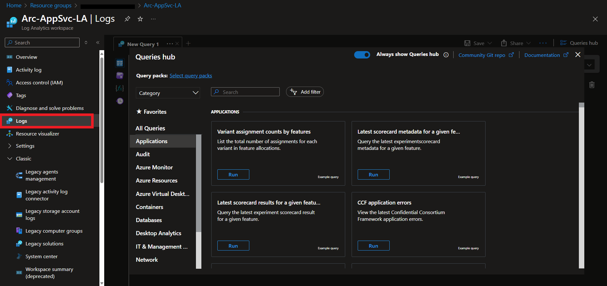

- Select Logs in the left navigation settings, and run the below query.

    ```shell
    let StartTime = ago(72h);
    let EndTime = now();
    ContainerAppConsoleLogs_CL
    | where TimeGenerated between (StartTime .. EndTime)
    | where ContainerAppName_s =~ "store"
    ```

  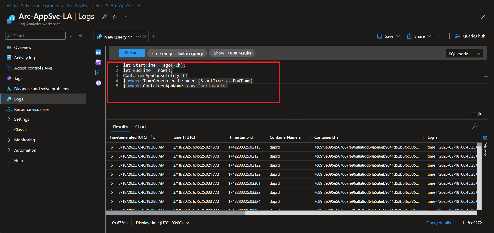

  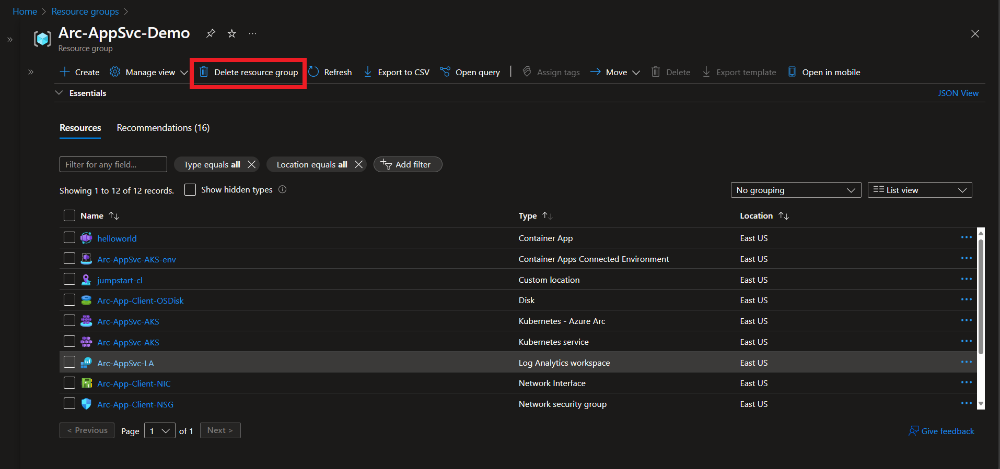

    > **Note:** If there's an error when running a query, try again in 10-15 minutes. There may be a delay for Log Analytics to start receiving logs from the application.

## Cleanup

- If you want to delete the entire environment, simply delete the deployed resource group from the Azure portal.

  
